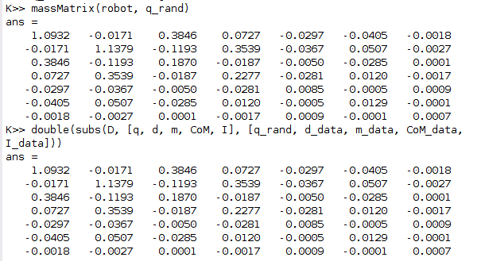
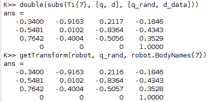
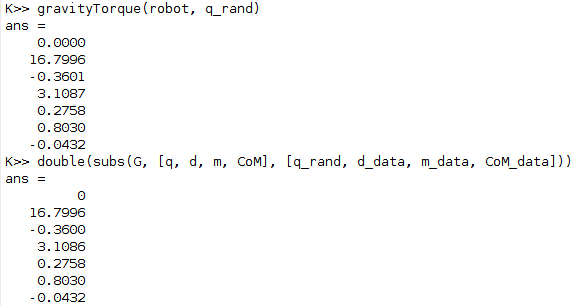
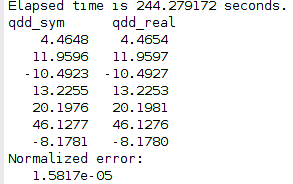

# Symbolic Dynamics
Can machines beat humans in the symbolic space?  
Some documentation is on the [Notion](https://www.notion.so/Symbolic-Dynamics-48e1fd577cab490193e373d776ac2949) page.
## Instruction
Run `startup.m` to set path. Run `test.m` to see the comparison between the symbolic dynamics and the ground truth.
## Results
The comparison between the calculation of the symbolic function and the matlab toolbox is shown here.  
1. Mass matrix

    

2. Transformation matrix

    

3. Gravitation torque matrix

    

4. Forward dynamics

    

## Note
**Currently only support Kinova Gen 3. It needs a few modification to support all urdf robot.**  
The animation is currenly irrelavent and not done yet.
## Reference
1. [Robot Modeling and Control](https://www.wiley.com/en-us/Robot+Modeling+and+Control%2C+2nd+Edition-p-9781119524045)